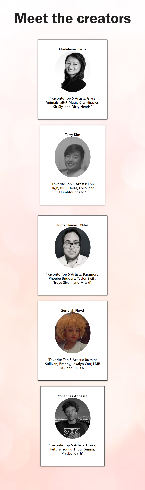

# MTHSY MUSIC!
MTHSY Music! By MTHSY (Madeleine Harris, Terry Kim, Hunter O'Neal, Serraiah Floyd, Yohannes Anbessa)

## Table of Contents

- [Description](#description)
- [Deployed Application](#deployed-application)
- [Installation](#installation)
- [Usage](#usage)
- [Credits](#credits)
- [License](#license)

## Description

MTHSY Music! is a music search application that displays specific information about an artist or a song. 

- It allows a user to search an artist or a song title. 
- If an artist is searched, then it will display their top 5 most played songs, a YouTube video of the top played song, and an upcoming concert involving that artist within the United States.
- If a song title is searched, then it will display the top five song titles that match the search result, a YouTube video of the top played song, and an upcoming concert involving that artist.
- If any blanks are inputed, then it will display an error modal to ask them to search again.
- If any concerts or events involving an artist is not within the United States, then it will display everything but the upcoming concert information.

 

- What was your motivation?

As music lovers, there many of us who enjoy specific songs, specific artists, or attending concerts. There are times where we forget the name of a popular song, or miss a concert, because we never knew a certain artist was having any concerts in the first place. 

- Why did you build this project? (Note: the answer is not "Because it was a homework assignment.")

So why not create an application that fixes those problems altogether? This application was created for music lovers who want to know an artist's top tracks and see any upcoming concerts featuring that artist.

- What problem does it solve?

Isn't it just a hassle when you forget that one song name that you already know of? Doesn't it frustrate you when there was a concert you missed, because you had no knowledge of it? 
This application will always be updated to show the next upcoming concert, or the most played track.

- What did you learn?

We learned using multiple APIs cause chain-links of problems if one happened to not function well. However, we also learned that posing certain APIs independently and dependently on specific functions allow the user to understand how the function is ran, called, or fetched. 

- What makes your project stand out?

Our project has three APIs: lastFM, YouTube, and TicketMaster.
We used lastFM's API as our main independent API, so that certain values or strings can be received then be called into functions involving YouTube API and TicketMaster API.

## Deployed Application Link

https://miss-mad.github.io/mthsy-music/

## Installation

No installation needed. Just open the link of the deployed application and unleash the inner music fanatic!

## Usage

How to use:
1] Think of your favorite artist or song title
2] Search by either one, or both, to be presented with the top songs for that artist and/or the song title's

Below are screenshots of the deployed application:

## Credits

Collaborators:

Group 1:
 Madeleine Harris, Terry Kim, Hunter O'Neal, Serraiah Floyd, Yohannes Anbessa

Links of resources used:

https://www.w3schools.com/

https://developer.mozilla.org/en-US/

https://www.last.fm/api

https://developer.ticketmaster.com/products-and-docs/apis/getting-started/

https://developers.google.com/youtube/v3

## License

No licenses.

---